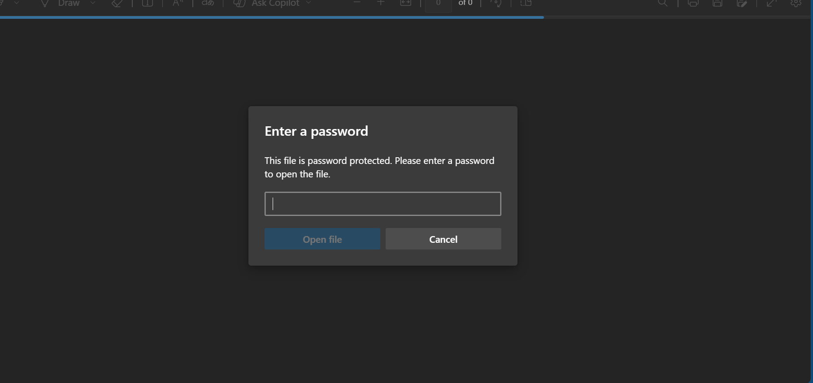
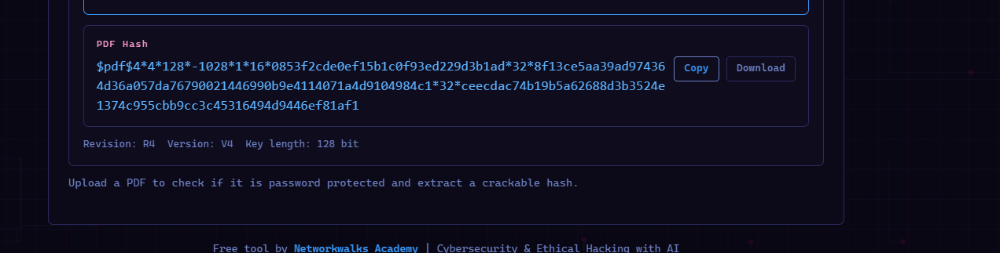
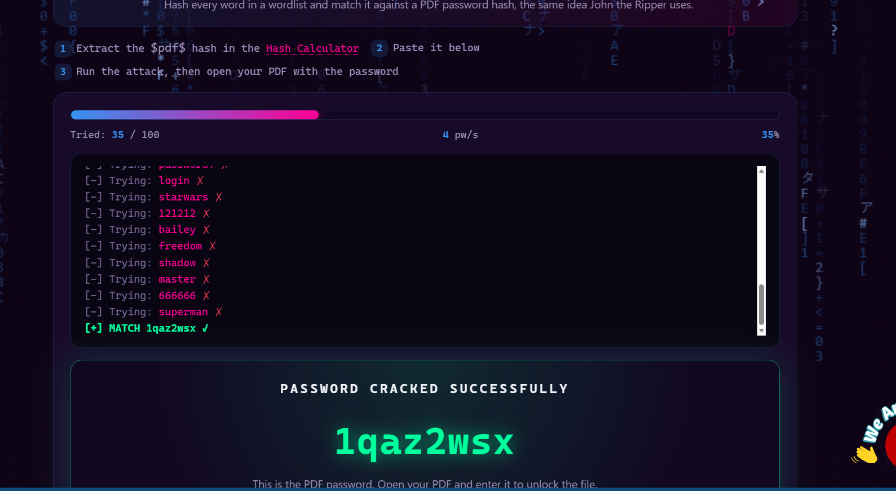
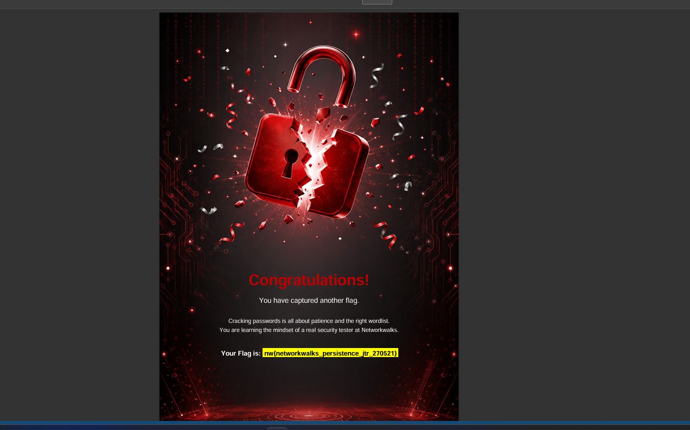

# Penetration Testing Report — Password Cracking (Week 3)

**Pentester:** Daramola Israel Ayomikun
**Program/Batch:** B082 – Networkwalks
**Date:** [insert date]
**Module Completed:** W3-PM2 (Password Cracking with Networkwalks Tools)
**Phase Covered:** Phase 3 — Gaining Access (Password/Credential Attacks)

---

## ⚠️ Liability Disclaimer

I have performed these activities only on files provided for this exercise (`My Locked PDF1.pdf`, supplied by Networkwalks for training purposes) or systems/files that I own myself. All materials here are for education and research purposes only. Unauthorized password cracking or accessing files without permission is illegal in most jurisdictions, even when no damage occurs. Misuse of this knowledge is the sole responsibility of the person doing it — not the instructor, the author, or Networkwalks.

**Target:** `My Locked PDF1.pdf` — provided lab file, authorized for this exercise

---

## Introduction

This report documents the password cracking phase of my ongoing cybersecurity internship at Networkwalks — Week 3, Project Module 2. Unlike Weeks 1–2, which focused on environment setup and reconnaissance, this module represents the first step into **Phase 3 (Gaining Access)** of the penetration testing methodology: recovering a password protecting a locked file.

The exercise used two free, browser-based tools built by Networkwalks:
- **Hash Calculator** — extracts the password hash from an encrypted PDF
- **Password Cracker** — attacks that hash to recover the plaintext password

No installation was required; both tools run entirely in-browser.

---

## Background Concepts

- **Encryption vs. Hashing:** Encryption is a two-way function — what is encrypted can be decrypted with the correct key. Hashing is a one-way function that scrambles plaintext into a fixed "digest," which cannot be reversed directly — it must instead be *matched* by trying candidate passwords until one produces the same hash.
- **Why file hashes matter:** Locked PDFs, ZIPs, and Office documents store their password protection as a hash rather than the plaintext password itself. Cracking tools extract this hash and test it against wordlists or brute-force attempts until a match is found.

---

## Tools Used

| Tool | Purpose |
|---|---|
| Networkwalks Hash Calculator | Extracts the password hash from a locked PDF file |
| Networkwalks Password Cracker | Attacks the extracted hash to recover the plaintext password |

---

## Activities Performed

### Step 1: Obtain the locked file
Downloaded the encrypted target file `My Locked PDF1.pdf` from the official lab page.



---

### Step 2: Extract the password hash
Opened the Networkwalks Hash Calculator (`networkwalks.com/hash-calculator`) and uploaded `My Locked PDF1.pdf`. The tool read the file's encryption metadata and returned a hash value beginning with `$pdf$...`.

**Extracted hash:**
```
[insert full hash value here — starts with $pdf$]
```



---

### Step 3: Crack the hash
Opened the Networkwalks Password Cracker (`networkwalks.com/password-cracker`), pasted the extracted hash, and started the attack. The tool tested candidate passwords against the hash until a match was found.

**Cracked password:**
```
[insert the recovered password here]
```

**Time taken:** [insert approx. time, e.g. "under 2 minutes" — note in your findings whether this reflects a weak/common password]



---

### Step 4: Verify the recovered password
Opened `My Locked PDF1.pdf` and entered the cracked password. The file unlocked successfully, confirming the password was correctly recovered.



---

## Findings & Analysis

| # | Finding | Observation | Impact | Risk Level |
|---|---|---|---|---|
| 1 | PDF password successfully cracked | Password recovered in [insert time] using an online cracking tool with no specialized hardware | Demonstrates that weak/common passwords on locked documents provide minimal real protection | 🔴 High *(if password was weak/short)* / 🟠 Medium *(if moderately complex)* |
| 2 | No local tooling required | Entire attack performed via free, browser-based tools — no installation, no command-line skill needed | Lowers the barrier to entry for this type of attack significantly | 🟠 Medium |

*Adjust the risk level above based on how complex the actual cracked password was — a short, common password is a stronger finding than a long one.*

---

## Why This Matters (Attacker's Perspective)

This exercise demonstrates a core truth in security: **password strength is often the only real barrier** between a locked file and full access to its contents. A short or common password can be recovered in minutes using free, publicly available tools — no advanced skills or expensive hardware required. This is precisely why organizations enforce password complexity policies (minimum length, mixed character types) and why reused/common passwords are so dangerous — the same weak password protecting a personal file is often reused elsewhere, multiplying the impact of a single successful crack.

The supporting facts from this module reinforce the scale of the problem: a simple 8-character lowercase password can be cracked in minutes, while a strong 12-character mixed password can take years; billions of leaked credential pairs already circulate on the dark web from past breaches — meaning many "cracks" in the real world don't even require brute-forcing, just checking known leaked password databases first.

---

## Recommendations

1. **Use long, complex passwords** — minimum 12+ characters, mixing uppercase, lowercase, numbers, and symbols, for any file or account that needs real protection.
2. **Avoid common/predictable passwords** — words like "password," "123456," or personal information (names, birthdates) are cracked almost instantly.
3. **Don't reuse passwords across files/accounts** — a single leaked or cracked password should not compromise multiple systems.
4. **Use a password manager** — generates and stores strong, unique passwords without requiring memorization.
5. **Where possible, use additional protection layers** — e.g. two-factor authentication, which password cracking alone cannot bypass.
6. **Be aware of hash-based attacks** — understand that file "password protection" is often only as strong as the password itself once the hash is exposed.

---

## Conclusion

This module provided hands-on exposure to a fundamental technique in penetration testing: extracting and cracking a password hash from a protected file. Using only free, browser-based Networkwalks tools, I successfully recovered the password protecting `My Locked PDF1.pdf` in [insert time], reinforcing how quickly weak passwords can be defeated even without specialized hardware or command-line tools.

This exercise marks my first practical step into **Phase 3 (Gaining Access)** of the penetration testing methodology, building directly on the reconnaissance (Phase 1) and scanning (Phase 2) work completed in Weeks 1 and 2. Future modules will continue building toward more advanced exploitation and access techniques.

---

## Evidence Collected

All screenshots referenced above are stored in the [`/evidence`](./evidences) folder of this repository.

---

**Author:** Daramola Israel Ayomikun
**Role:** Cybersecurity Intern, B083 – Networkwalks
**LinkedIn:** [linkedin.com/in/your-profile](https://lnkd.in/p/e-FXQAiQ)

**Program:** Cybersecurity Internship at Networkwalks | Week 03
